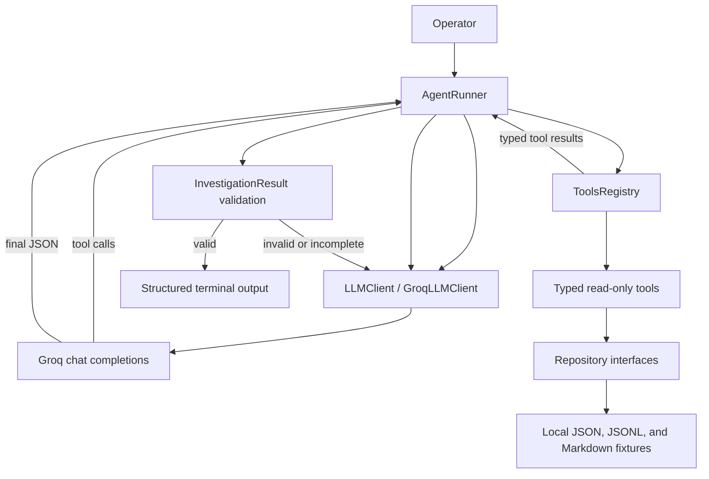

# Incident Triage Assistant

A learning project that implements an AI operations incident investigator from first principles. The assistant uses a manually written agent loop, Groq tool calling, Pydantic validation, and local mock operational data. It deliberately avoids agent orchestration frameworks so the control flow remains visible.

## What this project demonstrates

- A manual LLM → tool → result → LLM orchestration loop.
- Typed tool definitions, arguments, and responses.
- Repository interfaces that separate tools from JSON fixture access.
- Conversation-history management for user, assistant, tool, and system messages.
- Provider-error translation and bounded retry of malformed tool calls.
- Structured, validated investigation results.
- Corrective continuation when the model returns incomplete or invalid output.
- Iteration limits that prevent unbounded tool and correction loops.
- A safety-oriented design in which current operational tools are read-only.

## Architecture



The main boundaries are:

- `AgentRunner` owns orchestration and loop limits.
- `LLMClient` defines provider-independent LLM operations.
- `GroqLLMClient` owns Groq request formatting, history, and provider retries.
- `ToolsRegistry` registers and dispatches tools.
- Tools validate LLM arguments and construct stable responses.
- Repositories own fixture parsing, filtering, and ordering.
- `InvestigationResult` is the final application-level output contract.

## Available tools

| Tool | Purpose |
| --- | --- |
| `get_incident` | Retrieve the incident record and alert context. |
| `get_service_context` | Retrieve ownership, dependencies, SLOs, and runbooks. |
| `get_recent_deployments` | Find deployments near the incident window. |
| `query_metrics` | Query selected service metrics over a bounded interval. |
| `query_logs` | Query bounded logs by service, environment, severity, and content. |
| `get_runbook` | Retrieve a complete operational runbook. |
| `get_maintenance_windows` | Find maintenance windows overlapping the incident. |
| `get_feature_flags` | Find relevant service feature-flag state and changes. |

All currently registered tools are read-only.

## Running the assistant

Requirements:

- Python 3.14 or newer.
- [`uv`](https://docs.astral.sh/uv/).
- A Groq API key.

Create a local `.env` using `src/incident_triage_assistant/.env.example` as the reference and configure:

```dotenv
GROQ_API_KEY=your-key
GROQ_MODEL=your-tool-capable-model
GROQ_TEMPERATURE=0.2
GROQ_RETRY_COUNT=2
```

Install dependencies and run:

```bash
uv sync
uv run assistant
```

Enter an incident-oriented question, for example:

```text
investigate the incident INC-1042
```

Enter `exit` to close the application.

## Agent lifecycle

1. The user submits an investigation question.
2. The model requests one or more tools.
3. The runner validates and executes each tool through the registry.
4. Tool results are added to conversation history.
5. The loop continues until the model returns content instead of tool calls.
6. Content is validated as `InvestigationResult`.
7. Invalid or incomplete output receives bounded corrective feedback.
8. A valid result is printed as formatted JSON.

The tool loop and invalid-result correction loop have independent limits. Unexpected programming errors are not hidden; expected LLM and orchestration failures are converted into readable application messages.

## Project layout

```text
src/incident_triage_assistant/
├── investigation/       # Structured final-result schema
├── llm/                 # LLM abstraction, Groq adapter, prompts, and errors
├── loop/                # Manual orchestration loop and loop errors
├── repositories/        # Repository interfaces and JSON-backed implementations
└── tools/               # Tool schemas, definitions, handlers, and registry

data/
├── fixtures/            # Mock incidents, services, telemetry, and change data
└── runbooks/            # Mock operational runbooks

tests/
├── investigation/
├── llm/
├── loop/
├── repositories/
└── tools/
```

## Verification

Run the full suite with:

```bash
uv run pytest -q
```

At the learning milestone captured by this documentation, the suite contains 128 passing tests.

## Learning-version scope

This version intentionally uses no LangChain, LangGraph, CrewAI, PydanticAI, AutoGen, or Google ADK. The objective is to understand the mechanics those frameworks may later abstract: message history, tool schemas, dispatch, state transitions, retries, validation, and safety boundaries.

See [Known limitations](docs/known-limitations.md) for intentionally unfinished production concerns and [the reference investigation transcript](docs/example-investigation.md) for an end-to-end example.

## Milestone status

The project has achieved its learning objective: the manual agent loop and its major reliability boundaries are implemented and understood. Human-approved mutation tools, durable state, and production integrations are explicitly deferred rather than required for course readiness.
