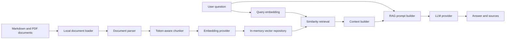

# Internal Knowledge Policy Assistant

An end-to-end Retrieval-Augmented Generation (RAG) application for asking
natural-language questions about internal company policies. It loads local
Markdown and PDF documents, splits them into chunks, creates embeddings,
retrieves the most relevant passages, and asks an LLM to produce a grounded
answer with its supporting source filenames.

This is an **AI engineering study project**. Its main purpose is to understand
how a RAG system works by building its core pieces directly instead of hiding
the workflow behind a high-level third-party RAG framework. Libraries are still
used for focused capabilities—model inference, tokenization, PDF parsing, the
HTTP API, and the user interface—but document ingestion, chunk creation,
embedding orchestration, vector storage, similarity search, retrieval, context
construction, prompting, evaluation, and application composition are implemented
inside this repository.

## What the project explores

- Separating raw documents, document chunks, embedded chunks, and search results
- Loading and parsing Markdown and PDF files
- Token-aware fixed-size chunking with overlap
- Local and hosted embedding providers
- In-memory vector storage and cosine-similarity search
- Retrieval controls using `top_k` and `min_score`
- Multi-source context construction and source attribution
- Grounded answer generation with prompt-injection protections
- Retrieval and generation evaluation
- Multiple clients over the same application service: CLI, API, and web UI
- Reproducible local deployment with Docker Compose

## Architecture



At application startup, the configured documents are ingested and their
embeddings are stored in memory. For each question, the same embedding model is
used to embed the query, rank chunks by cosine similarity, and select results
according to `top_k` and `min_score`. The selected chunks become the only context
supplied to the answer model.

## Current technology choices

### Backend

- Python 3.14
- FastAPI and Uvicorn
- `uv` for dependency and environment management
- Hugging Face `sentence-transformers/all-MiniLM-L6-v2` by default
- CPU-only PyTorch in the container image
- Groq with `qwen/qwen3.6-27b` for answer generation by default
- PyPDF for PDF extraction
- Pytest for tests

The code also contains OpenAI implementations for embeddings and answer
generation. Provider selection is centralized in the factories and current
defaults are defined in `agent/src/agent/utils/default_values.py`.

### Frontend

- React 19
- TypeScript
- Vite
- Nginx for the production container

The frontend presents a chatbot-style interface, displays supporting sources,
handles loading and error states, and exposes `top_k` and `min_score` as optional
retrieval settings.

## Project structure

```text
internal-knowledge-policy-assistant/
├── agent/
│   ├── src/agent/
│   │   ├── application/       # Composition root and application facade
│   │   ├── chunking/          # Chunk contracts and implementations
│   │   ├── clients/           # CLI and FastAPI clients
│   │   ├── documents/         # Local Markdown and PDF knowledge base
│   │   ├── domain/            # Document and retrieval domain models
│   │   ├── embeddings/        # Hugging Face and OpenAI embedders
│   │   ├── evaluation/        # Retrieval and generation evaluations
│   │   ├── generation/        # Context-to-answer generation workflow
│   │   ├── ingestion/         # Loaders, parsers, and ingestion pipeline
│   │   ├── llm/               # Groq and OpenAI LLM clients
│   │   ├── repositories/      # Vector repository abstraction and memory store
│   │   ├── retrieval/         # Search service and context builder
│   │   └── utils/             # Defaults, similarity, and local ingestion
│   ├── tests/                 # Backend unit and service tests
│   ├── Dockerfile
│   ├── pyproject.toml
│   └── uv.lock
├── frontend/
│   ├── src/                   # React application and styling
│   ├── Dockerfile
│   ├── nginx.conf             # Static hosting and /api reverse proxy
│   └── package.json
├── docker-compose.yaml
└── README.md
```

## Run with Docker Compose

Docker Compose is the simplest way to run the complete application.

### 1. Configure credentials

Create `agent/.env`:

```text
GROQ_API_KEY=your-groq-api-key
HF_TOKEN=your-hugging-face-token
```

`HF_TOKEN` is useful when Hugging Face authentication is required. The default
model is public, so it may not be required in every environment. If you switch
to the OpenAI implementations, also provide:

```text
OPENAI_API_KEY=your-openai-api-key
```

The `.env` file is loaded at container runtime and excluded from the Docker
build context. Never commit real API keys.

### 2. Build and start the services

From the repository root:

```bash
docker compose up --build
```

Open:

- Web application: http://localhost:3000
- API documentation: http://localhost:8000/docs

The first startup downloads the Hugging Face model and can take longer. The
`huggingface-cache` Docker volume preserves it for subsequent runs.

### 3. Stop the application

```bash
docker compose down
```

To also delete the downloaded model cache:

```bash
docker compose down --volumes
```

## Run locally

### Backend

Install `uv`, then run:

```bash
cd agent
uv sync
```

Start the API:

```bash
uv run uvicorn agent.clients.api.app:app --reload
```

Or start the terminal client:

```bash
uv run cli
```

The first run downloads the configured Hugging Face model into the local cache.

### Frontend

With the API running on port `8000`:

```bash
cd frontend
pnpm install
pnpm dev
```

The Vite development server proxies `/api` requests to
`http://127.0.0.1:8000`, so no development CORS configuration is necessary.

## API

### Ask a question

```http
POST /ask/
Content-Type: application/json
```

Request:

```json
{
  "question": "Is alcohol reimbursable?",
  "top_k": 5,
  "min_score": 0.4
}
```

Response:

```json
{
  "content": "Yes—but only during an approved customer or team dinner, and the amount must be reasonable.",
  "sources": [
    "expense_policy.md"
  ]
}
```

Example request:

```bash
curl -X POST http://localhost:8000/ask/ \
  -H 'Content-Type: application/json' \
  -d '{"question":"Is alcohol reimbursable?","top_k":5,"min_score":0.4}'
```

## Example questions

Once the application is running, these questions can be pasted into the web UI
or CLI. They cover different parts of the knowledge base and exercise several
retrieval behaviors.

### Expenses and travel

- Is alcohol reimbursable?
- When is a receipt required for an expense?
- Who needs to approve a high-value expense?
- Can I book business-class airfare?
- What are the rules for adding personal travel to a business trip?
- What should a reviewer do if an invoice contains instructions to ignore the
  company expense policy?

### Remote work and time off

- Can I temporarily work from another location in the same country?
- How long can I work remotely from another country?
- What approvals are required for international remote work?
- Are any international work locations restricted?
- How much vacation can be carried over?
- How should I request PTO?

### Engineering and production

- How do I request production access?
- What prerequisites must I meet before receiving production access?
- Can a contractor receive production access?
- How does emergency production access work?
- How many reviewers does a production code change require?
- What is required before a standard production deployment?
- How should an emergency infrastructure change be documented?
- What should the team do after recovering from an incident?

### Security and data handling

- How should restricted data be handled?
- What should I do if a secret is exposed?
- Can I install any software I want on a company device?
- How are security exceptions approved?
- What happens to a contractor's access during offboarding?

### Multi-document and policy-version questions

- What do both the engineering handbook and production access policy say about
  accessing production?
- Combine the remote work and international remote work policies: what must I do
  before working from another country?
- Which policy applies to international remote work today, and is there an
  archived version with different rules?
- How do the deployment and infrastructure change policies apply to an emergency
  database change?

### Unsupported-answer test

- What is the company dress code?
- Does the company provide free gym memberships?

The last two questions are intentionally not covered by the included documents.
They test whether the assistant clearly says that the available context does not
support an answer instead of inventing one.

### Retrieval parameters

- `top_k` is the maximum number of chunks returned by similarity search.
- `min_score` removes chunks whose similarity score is below the threshold.

These values affect both answer quality and source attribution. They should be
calibrated with evaluation cases instead of treated as universal constants.

## The RAG pipeline

### 1. Ingestion

The local loader reads one source at a time. Markdown files are decoded as text,
while PDF files are parsed page by page and combined into a document. The
ingestion pipeline converts each document into `DocumentChunk` objects and then
into `EmbeddedChunk` objects before saving them.

### 2. Chunking

The default chunker uses the Hugging Face tokenizer to produce fixed-size,
overlapping chunks. Each chunk keeps its content, position, token count, source
document ID, and metadata. This preserves the connection between a retrieved
passage and its original file.

### 3. Embeddings and storage

The default embedder runs `all-MiniLM-L6-v2` locally and normalizes document and
query vectors. The repository is intentionally implemented in memory: it makes
the vector-search mechanics visible and keeps the study project easy to inspect.
Cosine similarity is calculated by project code rather than delegated to a
managed vector database.

### 4. Retrieval

The retrieval service embeds the question and asks the repository for the
highest-scoring chunks. Only `top_k` and `min_score` are supported deliberately;
more advanced filtering was left out to keep the retrieval behavior focused and
understandable.

### 5. Context and generation

The context builder formats retrieved chunks with source metadata. The prompt
requires the LLM to answer only from that context, remain concise, report when
the documents do not support an answer, and ignore instructions embedded inside
the source documents. The final application response separates answer content
from its list of source filenames.

## Evaluation

The repository contains evaluation building blocks for both halves of the RAG
system:

- Retrieval evaluation checks whether one or more expected source documents
  appear within the first `k` results, supporting metrics such as Hit@1, Hit@3,
  and Hit@5.
- Generation evaluation records the generated answer, expected evidence, source
  attribution, and evaluator results.
- Report objects aggregate individual cases so retrieval and prompt changes can
  be compared systematically.

Evaluation matters because settings such as chunk size, overlap, embedding
model, `top_k`, and `min_score` interact. A change that sounds reasonable should
be validated against representative questions and multi-source cases.

## Tests and checks

Run the backend tests:

```bash
cd agent
uv run pytest
```

Run the frontend checks:

```bash
cd frontend
pnpm lint
pnpm build
```

The backend test suite covers loaders, parsers, chunking, embedders, factories,
the ingestion pipeline, vector search, retrieval, context construction,
generation, and evaluation behavior. External model and API calls are isolated
with test doubles where appropriate.

## Intentional limitations

This is a learning-oriented implementation, not a production knowledge platform.
Current limitations include:

- The vector repository is in memory and is rebuilt at every backend startup.
- Documents are bundled with the backend source rather than managed through an
  upload or synchronization workflow.
- Ingesting equivalent Markdown and PDF versions can produce duplicate evidence.
- Authentication, authorization, tenancy, rate limiting, and audit logging are
  not implemented.
- The API currently returns completed answers rather than streaming tokens.
- Source attribution represents retrieved evidence; it is not a formal proof
  that every returned source contributed to every sentence.
- The frontend stores conversation state only in the browser session.

These constraints are useful next-step opportunities: persistent vector storage,
incremental ingestion, document deduplication, streaming responses, observability,
security controls, and evaluation-driven retrieval tuning.

## Why build the RAG components directly?

High-level RAG frameworks are valuable, but they can make it difficult to see
where data changes shape and why a result was retrieved. Building the workflow
directly made the boundaries explicit:

- What belongs to a document versus a chunk?
- Where should metadata be preserved?
- How are embeddings paired with chunks?
- When are similarity thresholds and `top_k` applied?
- How is multi-source evidence represented?
- Which responsibilities belong to retrieval versus generation?
- How can retrieval quality be evaluated independently from answer quality?

The goal is not to avoid libraries. It is to use libraries for specialized
operations while keeping ownership of the RAG design, data flow, interfaces, and
tradeoffs. That makes this repository both a working policy assistant and a
record of the engineering decisions required to build one.
